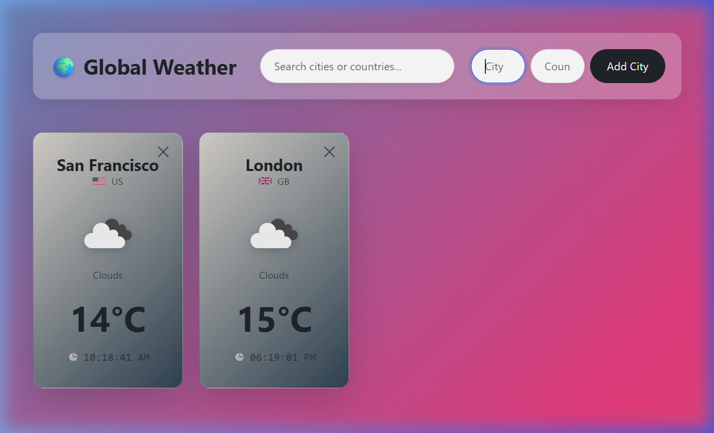

# 🌍 Global Weather Dashboard

A real-time, single-page weather dashboard built with React and TypeScript that displays live weather data for cities around the world.

> **Design Document:** [Global Weather Dashboard HLD](https://docs.google.com/document/d/1vwlg3nGNe5d--_7FCXXEs8GIVar19lBitIt5T-8AIlg/edit?usp=sharing)

---

## Purpose

This project was built to practice design thinking alongside frontend development. The goal was to take a basic React exercise and evolve it into a fully designed, functional product — from a simple list of cities to a polished, global weather dashboard.

---

## Background

This project started as a basic SPA with a form that could:
1. Display a map of city and country
2. Add a new city and country
3. Search a city or country and display the result

Over time, it evolved into a full weather dashboard by integrating live API data, dynamic visuals, and a premium UI.

---

## Features

- 🔍 **Search** cities by name in real time
- ➕ **Add** any city worldwide using its name and country code
- 🌡️ **Live Weather Data** — temperature, condition, and local time fetched from OpenWeatherMap
- 🎨 **Dynamic Gradients** — card backgrounds adapt based on weather condition (Clear, Clouds, Rain, etc.) and time of day (day vs. night)
- 🏳️ **Country Flags** — each tile shows the city's national flag
- 🕒 **Accurate Local Time** — calculated using the UTC offset provided by the API
- 💾 **Persistent State** — cities are saved to `localStorage` and restored on page reload

---

## Component Architecture

The app is broken into focused, modular React components:

| Component | Responsibility |
|---|---|
| `App` | Root entry point |
| `WeatherDashboard` | Orchestrates the layout; delegates logic to `useWeather` |
| `SearchBar` | Input field for filtering displayed cities |
| `AddToMap` | Form logic to look up and add a new city |
| `WeatherCard` | Individual tile displaying city, country, temperature, local time, and weather icon |

### Custom Hook
- **`useWeather`** — Manages the `locationMap` state, localStorage persistence, city add/remove operations, and search filtering.

---

## Data Layer

- **API:** [OpenWeatherMap — Current Weather Data](https://openweathermap.org/api) (free tier)
- **Handler:** `src/api/OpenWeatherMapAPIHandler.ts`

### State Shape (`WeatherData`)

```ts
interface WeatherData {
  city: string;      // City name
  country: string;   // Country code (e.g., "US")
  temp: number;      // Temperature in Celsius
  condition: string; // e.g., "Clouds", "Clear", "Rain"
  icon: string;      // OpenWeatherMap icon code (e.g., "04n")
  localTime: string; // Calculated from UTC offset (in seconds)
  humidity: number;  // Relative humidity percentage
}
```

---

## Getting Started

### Prerequisites
- Node.js ≥ 18
- An [OpenWeatherMap API key](https://openweathermap.org/api)

### Setup

1. **Clone the repository**
   ```bash
   git clone https://github.com/SnehangshuChakraborty/global-weather-app.git
   cd global-weather-app
   ```

2. **Install dependencies**
   ```bash
   npm install
   ```

3. **Create a `.env` file** in the project root (same directory as `package.json`):
   ```env
   VITE_APP_ID="YOUR-API-KEY-HERE"
   ```

4. **Start the development server**
   ```bash
   npm run dev
   ```

---

## Tech Stack

- **Framework:** React 18 + TypeScript
- **Build Tool:** Vite
- **Styling:** Bootstrap 5 + custom CSS (glassmorphism, animated gradients)
- **API:** OpenWeatherMap Current Weather API
- **Flags:** [flagcdn.com](https://flagcdn.com)
- **CI/CD:** GitHub Actions

---

## Screenshot



---

## Project Structure

```
src/
├── api/
│   └── OpenWeatherMapAPIHandler.ts  # Fetches data & calculates local time
├── components/
│   ├── AddToMap.tsx       # City search & add form
│   ├── SearchBar.tsx      # City filter input
│   ├── WeatherCard.tsx    # Individual weather tile
│   └── WeatherDashboard.tsx # Full-screen layout & grid
├── hooks/
│   └── useWeather.ts      # State, localStorage, and filtering logic
├── types/
│   ├── weather.ts         # WeatherData interface
│   └── index.ts           # Re-exports all types
├── utils/
│   └── weatherStyles.ts   # Dynamic gradient logic (condition + day/night + temp)
├── App.tsx
└── App.css                # Global styles, animations, glassmorphism utilities
```

---

## Design Decisions

| Decision | Rationale |
|---|---|
| `Map<string, WeatherData>` for state | City names act as natural unique keys; prevents duplicate tiles and makes lookups O(1) |
| `localStorage` over a backend | Keeps the app dependency-free and fully client-side, suitable for a learning project |
| Vite over Create React App | Faster HMR, leaner config, and better TypeScript support |
| Custom hook (`useWeather`) | Separates business logic from presentation, making the dashboard component purely declarative |
| Gradient-based card backgrounds | More performant and resilient than fetching background images; provides consistent visual feedback across all conditions |

---

## Known Limitations

- **API Rate Limit:** The OpenWeatherMap free tier allows up to **1,000 API calls/day**. Each city addition makes one call.
- **No sync across devices:** `localStorage` is browser- and device-specific. Tiles are not shared across sessions or devices.
- **City name sensitivity:** The Add City form requires a reasonably accurate city name and ISO country code (e.g., `London`, `GB`).
- **No auto-refresh:** Weather data reflects the moment a city was added. The page must be manually refreshed to get updated conditions.

---

## Future Roadmap

- [ ] **Auto-refresh** — Periodically re-fetch weather data for all tiles
- [ ] **5-day forecast** — Expandable tile showing an extended forecast
- [ ] **Unit toggle** — Switch between °C and °F
- [ ] **Drag-to-reorder** — Allow users to rearrange tiles via drag and drop
- [ ] **PWA support** — Offline access and home screen installation
- [ ] **Humidity & wind** — Display additional weather metrics on each tile

---

## Contributing

1. Fork the repository
2. Create a feature branch: `git checkout -b feature/your-feature`
3. Make your changes and commit: `git commit -m 'Add your feature'`
4. Push to your branch: `git push origin feature/your-feature`
5. Open a Pull Request against `main`

> Make sure `npm run build` passes with no errors before opening a PR.

---

## License

This project is open source and available under the [MIT License](LICENSE).
